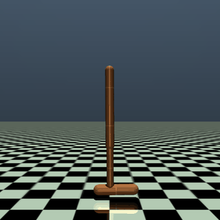
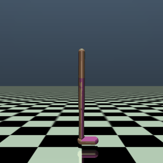
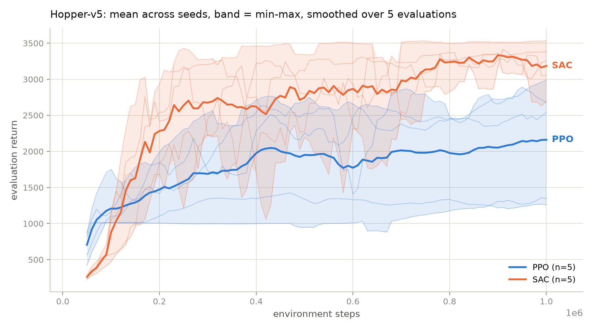
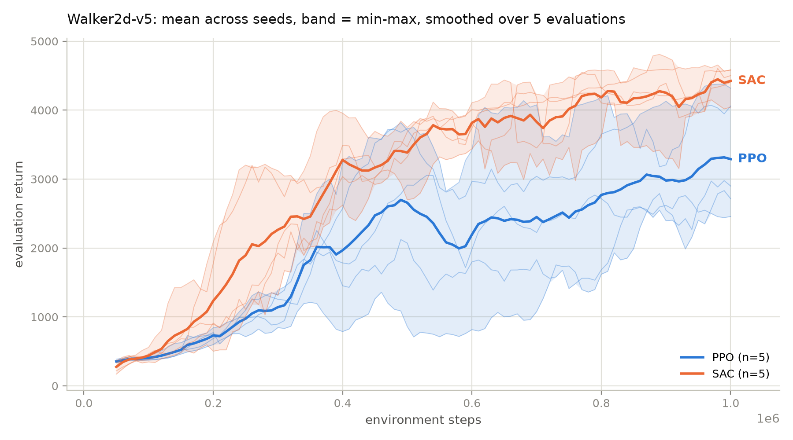

# Sample efficiency of PPO and SAC on MuJoCo locomotion

SAC beats PPO on both environments tested. Pairing the runs up, the SAC run
finished above the PPO run in 25 of 25 seed pairs on Hopper-v5 and 23 of 25 on
Walker2d-v5. How much cheaper SAC is depends heavily on the task: reaching a
return of 2000 costs it 3 times fewer environment steps than PPO on Hopper and
1.2 times fewer on Walker2d.

A crossover found on Hopper, where PPO appeared to reach low returns first, did
not survive: it shrank to two evaluation points once a configuration error was
fixed, and the ordering is reversed on Walker2d.

| Hopper-v5 | Walker2d-v5 |
|---|---|
|  |  |

Trained SAC policies, best seed of five, acting deterministically. Recorded with
`record_policy.py`, which reloads the saved checkpoint and, for PPO, the saved
observation normalization that the policy was trained under.





## Question

How many environment steps does each algorithm need to reach a given level of
performance, and does the answer hold across tasks?

This is deliberately not "which algorithm is better". Final performance under an
unlimited budget is a different question from step cost, and step cost is the one
that matters when the environment is slow or when the policy will eventually run
on physical hardware.

## Setup

| | |
|---|---|
| Environments | Hopper-v5 and Walker2d-v5 (Gymnasium, MuJoCo) |
| Arms | PPO, SAC, plus SAC with `learning_starts=1000` on Hopper |
| Budget | 1,000,000 environment steps per run |
| Seeds | 5 per arm per environment, 25 runs in total |
| Evaluation | every 10k steps, 10 episodes, deterministic policy, separate env |
| Hardware | Apple M3 Pro, CPU only, 6 concurrent runs |

Evaluation runs in its own environment instance seeded differently from training,
and uses the deterministic policy rather than the sampling one. Training returns
are not used as a performance measure anywhere in this repo: during training the
policy is exploring, so its return is both depressed and noisy.

For PPO the observations and rewards are normalized with `VecNormalize`, which is
what the published configuration specifies. SAC is not normalized, because reward
scaling interferes with its automatic entropy temperature tuning. The
normalization statistics are frozen during evaluation and reward normalization is
disabled there, so all arms are scored on the raw reward scale.

## Hyperparameters

Values are transcribed from
[rl-baselines3-zoo](https://github.com/DLR-RM/rl-baselines3-zoo),
`hyperparams/ppo.yml` and `hyperparams/sac.yml`, not chosen here. SAC works
reasonably well out of the box on MuJoCo while PPO with library defaults does not,
so a comparison between a tuned algorithm and an untuned one would measure tuning
effort rather than the algorithms.

The zoo tunes PPO per environment, so `run_experiment.py` holds a table keyed by
environment and raises rather than reusing another task's values. SAC's entry for
MuJoCo locomotion is one shared anchor, SB3 defaults with `learning_starts` raised
to 10000, identical across these tasks. The zoo publishes v4 entries and they are
applied here to v5, which changed the environments only slightly.

Every run records its full configuration, and any deliberate override, in
`results/<env>/<arm>/seed_<n>/config.json`.

## Results

### Final performance

Average of the last 10 evaluation points of each seed, then aggregated across
seeds. Taking the single best evaluation point instead would reward lucky
evaluations and inflate every number.

The headline aggregate is the interquartile mean, the average of the middle 50%
of seeds, with a percentile bootstrap interval. The mean and its t interval are
shown beside it, because where the two disagree the mean is being moved by a
single extreme run. Reasons for the choice are in the next section.

**Hopper-v5**

| Arm | IQM | 95% CI (bootstrap) | Mean | 95% CI (t) | Min | Max |
|---|---|---|---|---|---|---|
| PPO | 2224.5 | [1800, 2717] | 2252.4 | +/- 549.4 | 1777.2 | 2811.3 |
| SAC | 3216.6 | [2998, 3472] | 3228.5 | +/- 280.0 | 2968.5 | 3524.1 |
| SAC, `learning_starts=1000` | 3298.1 | [2917, 3467] | 3247.5 | +/- 350.8 | 2832.9 | 3510.2 |

**Walker2d-v5**

| Arm | IQM | 95% CI (bootstrap) | Mean | 95% CI (t) | Min | Max |
|---|---|---|---|---|---|---|
| PPO | 3109.3 | [2512, 4184] | 3217.9 | +/- 1059.0 | 2488.8 | 4272.9 |
| SAC | 4321.5 | [4109, 4528] | 4327.1 | +/- 254.9 | 4070.2 | 4600.6 |

On Hopper the two groups are completely separated: the weakest SAC run (2968.5)
beat the strongest PPO run (2811.3). Every one of the 25 seed pairs goes the same
way, so the probability that a SAC run beats a PPO run is estimated at 1.00 and
the exact one sided Mann-Whitney p is 0.0040. That is the smallest value a 5
against 5 design can produce, so the test is saturated rather than merely
significant.

On Walker2d the groups interleave. SAC leads in 23 of 25 pairs, P = 0.92 at
p = 0.0159, but PPO's best seed finished above two of the five SAC seeds. The same
conclusion holds on both tasks with visibly different confidence.

The two SAC arms on Hopper remain indistinguishable. Their bootstrap intervals,
[2998, 3472] and [2917, 3467], overlap over almost their whole length, and the
IQM and the mean disagree about which arm is nominally ahead.

### How uncertainty is reported

Two choices, both following Agarwal et al. (2021), and both prompted by problems
this study actually hit.

**The interquartile mean instead of the mean.** A mean over five runs moves with
whichever run is most extreme. PPO on Walker2d is the clear case: its IQM is
3109.3 against a mean of 3217.9, because one seed finished at 4272.9 while another
finished at 2488.8. The IQM drops the best and the worst and averages the middle
three, so the number describes a typical run rather than the luckiest one. On
Hopper, where PPO's seeds sit closer together, the two differ by 28 points and the
choice barely matters. Where the gap is large, the mean is the one to distrust.

**A percentile bootstrap interval instead of a t interval.** The t interval
assumes the seed scores are normal and places a symmetric band around the mean.
On five runs it routinely reaches past what the environment can produce: an early
version of this study, aggregating three evaluation points, printed a lower bound
of -910 for a return that cannot go below zero. The bootstrap resamples the runs
with replacement and reads percentiles off the resulting distribution, so it
assumes nothing and cannot leave the observed range. It is also narrower here in
every case, by roughly 17%.

Both are computed in `aggregate_results.py` with a fixed resampling seed, so the
intervals are reproducible. With five runs the bootstrap resamples a very small
set and its coverage is optimistic; it is a better behaved interval than the t
one, not a tight one. Agarwal et al. address that by pooling runs across tasks,
which needs a per-task score normalization this study does not define.

### Sample efficiency

Environment steps at which the smoothed evaluation curve first reaches each
threshold, median across all seeds. Smoothing is a 5 point rolling mean applied
per seed before aggregation; without it a single lucky evaluation would count as
having reached the threshold. Seeds that never reached a threshold are censored at
the budget rather than dropped, so a count like (3/5) raises the reported cost
instead of hiding it.

**Hopper-v5**

| Threshold | PPO | SAC | SAC, `ls=1000` | SAC vs PPO |
|---|---|---|---|---|
| 1000 | 80k | 100k | 130k | PPO by 1.3x |
| 2000 | 510k | 170k | 190k | SAC by 3.0x |
| 2500 | 970k (3/5) | 190k | 340k | SAC by 5.1x |
| 3000 | not reached by any seed | 250k | 440k | SAC by more than 4x |

**Walker2d-v5**

| Threshold | PPO | SAC | SAC vs PPO |
|---|---|---|---|
| 1000 | 270k | 220k | SAC by 1.2x |
| 2000 | 370k | 300k | SAC by 1.2x |
| 2500 | 470k | 380k | SAC by 1.2x |
| 3000 | 530k (3/5) | 400k | SAC by 1.3x |

The direction is the same on both tasks above the lowest threshold. The magnitude
is not: a factor of 3 to 5 on Hopper against a flat factor of 1.2 on Walker2d.
Anyone quoting a single number for "how much more sample efficient SAC is" is
quoting a property of their benchmark.

### What replicated across environments

| Finding | Hopper | Walker2d | Verdict |
|---|---|---|---|
| SAC ends above PPO | 25 of 25 pairs, p = 0.0040 | 23 of 25 pairs, p = 0.0159 | replicated, weaker |
| SAC cheaper above low thresholds | 3.0x to 5.1x | 1.2x | replicated, magnitude varies 4x |
| PPO more variable across seeds | interval 1.9x wider than SAC | 4.0x wider | replicated |
| PPO reaches low returns first | 80k against 100k | 270k against 220k, reversed | **did not replicate** |

Interval widths above are bootstrap widths; the t intervals give 2.0x and 4.2x,
so this comparison does not depend on which one is used.

The last row is the reason the second environment was worth an hour and a half of
compute. On Hopper alone, PPO reaching a return of 1000 sooner looked like a real
phenomenon worth explaining, and an ablation was built around explaining it. On
Walker2d the ordering is the other way round, and on Hopper the remaining gap is
80k against 100k, two evaluation points apart and not separable from noise. There
is no early PPO advantage to explain.

## Ablation: is the replay warmup the reason SAC starts slowly?

SAC spends its first 10,000 steps collecting random actions without a single
gradient update, while PPO improves from its first batch. That suggested a
hypothesis for PPO's apparent early lead on Hopper, with a clear prediction:
reducing `learning_starts` should move SAC's early curve left and leave its
plateau alone. The prediction and what would count as a refutation were written
down before the run.

| Threshold | SAC | SAC, `ls=1000` | Predicted | Observed |
|---|---|---|---|---|
| 1000 | 100k | 130k | faster | 1.3x slower |
| 2000 | 170k | 190k | faster | 1.1x slower |
| 2500 | 190k | 340k | same or faster | 1.8x slower |
| 3000 | 250k | 440k | same or faster | 1.8x slower |

The plateau half held: 3247.5 against 3228.5, well inside the confidence
intervals. The speed half failed in the opposite direction at every threshold.
Removing the warmup does not buy an earlier start, it costs one.

A plausible reading is that updates against a buffer holding a thousand
transitions fit a narrow slice of experience and produce a worse critic, which
later training has to undo. That is presumably why the parameter exists. This repo
does not test that second explanation and does not claim it.

The Walker2d results then removed the ground the hypothesis stood on: the early
advantage it was built to explain does not exist outside Hopper. The ablation is
kept here because a hypothesis that was stated, tested and refuted is part of the
record, and because its result stands on its own: `learning_starts` is not free to
reduce.

## Small samples changed the conclusion twice

**Three seeds flipped the sign of an effect.** On 3 seeds the ablation looked
faster to a return of 1000 than baseline SAC, 130k against 160k, which read as
weak support for the hypothesis. On 5 seeds the baseline's median dropped to 100k
while the ablation's stayed at 130k, and the ordering reversed. No code changed,
only the amount of data.

**One environment produced a finding that does not exist.** The PPO early
advantage was the most interesting thing in the single environment version of this
study. It is absent on the second environment.

Both are the concern raised in Henderson et al. (2018). Five seeds and two
environments is not a fix, it is the smallest setup that made these two problems
visible.

## Correction

An earlier version of this study used a PPO configuration with two values that did
not match the zoo: `vf_coef` was 0.19 against a published 0.835671, and `ent_coef`
was 0.0 against a published 0.00229519. PPO therefore ran with its entropy bonus
switched off and its value loss weighted about four times too lightly, which
undercut the "published values on both sides" claim the study rests on.

The PPO arm on Hopper was rerun with the corrected values. The effect was
substantial: the confidence interval narrowed from +/- 1007.4 to +/- 549.4, the
worst seed improved from 1247.4 to 1777.2, and a claim in the earlier write-up
that two of five PPO runs never reached a return of 2000 turned out to be an
artifact of the error. With the correct configuration all five do. Corrected PPO
is also slower, reaching 2000 at 510k steps against 320k before, so the SAC
advantage on Hopper is larger than first reported, not smaller.

The error was caught by checking the transcribed numbers against the source file
rather than by anything in the results looking wrong. That is the uncomfortable
part and the reason it is recorded here.

## Limitations

- 5 seeds per arm. Enough to saturate the rank test on Hopper, not enough to
  estimate the size of any gap with precision. The PPO confidence interval on
  Walker2d spans a third of its own mean.
- Two environments. Better than one, and enough to show that a headline finding
  can fail to replicate, but not a benchmark.
- One budget. The comparison is specific to 1M steps. PPO is usually run for 5M to
  10M steps on these tasks, and on Walker2d it is still climbing at the end.
- The ablation ran on Hopper only, at a single value, 1000 against 10000.
- Thresholds are absolute and chosen by hand. A threshold based metric depends on
  where the thresholds sit; the four used here span the range the arms cover.
- The zoo publishes v4 hyperparameters and they are used on v5 here.
- The bootstrap interval resamples five runs. Its coverage at that sample size is
  optimistic, and the honest fix is more runs, not a different interval.
- Scores are not normalized per task, so the two environments are reported side by
  side rather than pooled into one aggregate.

## Reproduce

```bash
python -m venv .venv && source .venv/bin/activate
pip install -r requirements.txt

SEEDS=5 ./run_all.sh
SEEDS=5 ENV=Walker2d-v5 ./run_all.sh
SEEDS=5 ALGOS=sac LABEL=sac_ls1000 RUN_ARGS="--learning-starts 1000" ./run_all.sh

python aggregate_results.py --env Hopper-v5 --algos ppo sac sac_ls1000
python aggregate_results.py --env Walker2d-v5

python record_policy.py --env Hopper-v5 --arm sac
python record_policy.py --env Walker2d-v5 --arm sac
```

`record_policy.py` picks the highest scoring seed unless one is given. That is
fine for an illustration and would be misleading as a performance claim, so every
number reported above aggregates across all five seeds instead.

Raising `SEEDS` extends an existing sweep rather than repeating it: runs that
already have evaluation logs are skipped, and `FORCE=1` redoes them.

`run_all.sh` sets one BLAS thread per process and runs as many processes
concurrently as the machine has performance cores. The networks here are two
256 unit layers and the MuJoCo step is single threaded, so parallelism belongs
across runs rather than inside them. Twenty five runs at 1M steps took about four
hours in total on the hardware above.

Exact package versions used for the results above are in `requirements-lock.txt`.

## Repository layout

```
run_experiment.py      one (arm, seed) run
run_all.sh             the sweep, with bounded concurrency and skip-if-present
aggregate_results.py   curves, tables, statistics
record_policy.py       renders a saved checkpoint to mp4 and GIF
results/               evaluation logs and configs, one folder per run
figures/               generated plots
videos/                policy recordings, GIFs tracked and mp4s ignored
```

Model checkpoints are not tracked. Evaluation logs (`evaluations.npz`) and run
configs (`config.json`) are, since they are small and they are the actual evidence
behind every number above.

## References

- Schulman et al., Proximal Policy Optimization Algorithms, 2017. https://arxiv.org/abs/1707.06347
- Haarnoja et al., Soft Actor-Critic, 2018. https://arxiv.org/abs/1801.01290
- Raffin et al., Stable-Baselines3, JMLR 2021. https://jmlr.org/papers/v22/20-1364.html
- Raffin, RL Baselines3 Zoo, 2020. https://github.com/DLR-RM/rl-baselines3-zoo
- Towers et al., Gymnasium, 2024. https://arxiv.org/abs/2407.17032
- Todorov et al., MuJoCo: A physics engine for model-based control, IROS 2012.
- Agarwal et al., Deep Reinforcement Learning at the Edge of the Statistical Precipice, NeurIPS 2021. https://arxiv.org/abs/2108.13264
- Henderson et al., Deep Reinforcement Learning that Matters, AAAI 2018. https://arxiv.org/abs/1709.06560
